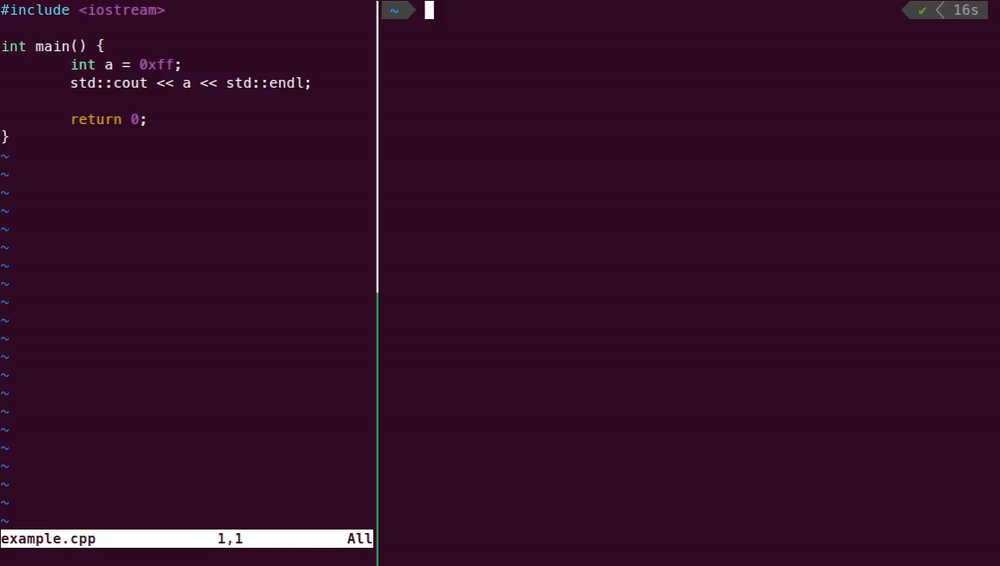

# autocheck
Following AUTOSAR guidelines can be easy and free!

Autocheck is a source code analysis tool based on Clang / LLVM infrastructure.

Its main purpose is to check code against AUTOSAR guidelines for the use of the C++14 language in critical and safety-related systems. The main application sector of these guidelines is automotive, but these guidelines can be used in other embedded application sectors.



## Supported Operating Systems

- Ubuntu 20.04 or newer
- Debian 11 or newer

## Install dependencies

- C++ compiler (e.g. g++, clang++, ...)
- git
- cmake
- ninja
- python 3 (for tests)

## Runtime dependencies

- glibc version 2.31 or newer
- libstdc++ development package version 10 or newer

## Clone the repo

Since we use ```llvm-project``` as submodule, we need to clone the submodule as well:

```
$ git clone --recurse-submodules git@github.com:syrmia/autocheck.git
```
As well as to ```pull``` the code, we need to do it as follows:

```
$ git pull --recurse-submodules
```

## Automated build

Run the `build.sh` script located in the project root directory to automatically initialize the submodule, build llvm and build autocheck:

```console
$ ./autocheck/build.sh
```

After the first build, you can just run `ninja` or `ninja autocheck` to compile again

## Manual build

1. Create a build directory
    ```console
    $ mkdir build && cd build
    ```
2. Build LLVM/Clang
    ```console
    $ mkdir llvm && cd llvm
    $ cmake -G "Ninja" ../../autocheck/src/llvm-project/llvm \
        -DCMAKE_BUILD_TYPE=Release \
        -DLLVM_TARGETS_TO_BUILD="X86" \
        -DLLVM_ENABLE_ASSERTIONS=ON \
        -DLLVM_ENABLE_PROJECTS="clang"
    $ ninja
    $ cd ..
    ```
3. Build autocheck
    ```console
    $ cmake -G "Ninja" ../autocheck -DCLANG_DIR="$PWD/llvm/lib/cmake/clang"
    $ ninja autocheck
    ```

After the first build, you can just run `ninja` or `ninja autocheck` to compile again

## Generating an installation package

### For debain-based distributions

After building the project, from the build directory run:
```console
cpack -G DEB
```
The generated package will be located in the same directory under the name `autocheck_[version]_amd64`.

*Note: You should generate .deb packages only on a debian-based system, otherwise it might not work properly.*

## Install package

### Ubuntu

Supports Ubutu 22.04 or newer.

To install the DEB package, run the following command:
```console
sudo apt install ./autocheck_[version]_amd64.deb
```
or open it using your Software Manager and click `Install`.

## Run the tool

If you built the tool run the following command from the build directory:
```console
$ ./bin/autocheck [file]
```
Otherwise, if you installed the tool, in any directory run:
```console
$ autocheck [file]
```
This will check compliance with all supported AUTOSAR rules in the given file.
For more options and examples see the following sections.

Autocheck requires a compilation database file (`compile_commands.json`) to work on a file that is a part of a project, otherwise it can't resolve include directives.
You can find out how to generate this file for your project [here](docs/CompilationDatabase.md).
If the compilation database is not specifed using the `-p` flag, autocheck will try to automatically find it.
It will first search the directory of the first input file and all of its parent directories.
If the file couldn't be found the following warning will be displayed:
```
Error while trying to load a compilation database:
Could not auto-detect compilation database for file "test.cpp"
No compilation database found in /path/to/input or any parent directory
fixed-compilation-database: Error while opening fixed database: No such file or directory
json-compilation-database: Error while opening JSON database: No such file or directory
Running without flags.
```

## Command line options

| Flag        | Description |
| ---         | ---         |
| `-W<rule>` | Enable the specified rule. For the full list of supported rules and their flags, see [AutosarRules](docs/AutosarRules.md). By default all rules are on (same as `-Wall`). |
| `-Wno-<rule>` | Disable the specified rule. For the full list of supported rules and their flags, see [AutosarRules](docs/AutosarRules.md). |
| `--check-between-lines=<from,to>` | Run autocheck only between given lines. |
| `--check-system-headers` | Check Autosar rules in system headers. |
| `--dont-check-headers` | Don't check Autosar rules in headers.
| `--dont-check-macro-expansions` | Don't check Autosar rules in macro expansions.
| `--warning-limit=<value>` | Set the limit of warnings per Autosar rule. By default, there is no limit.
| `-p <build-path>` | Path to compile command database.

## Examples

Let's look at the following code:
```cpp
#include <iostream>

int main() {
    int a = 0xff;
    std::cout << a << std::endl;

    return 0;
}
```

Running autocheck without extra options checks all AUTOSAR rules in the given file and the files it includes:

```
$ autocheck example.cpp
=== Autocheck - Modern and Free Autosar checker
example.cpp:4:12: warning: Hexadecimal constants should be upper case [A2-13-5]
        int a = 0xff;
                  ^
example.cpp:4:2: warning: Fixed width integer types from <cstdint>, indicating the size and signedness, shall be used in place of the basic numerical types [A3-9-1]
        int a = 0xff;
        ^
example.cpp:4:6: warning: Braced-initialization {}, without equals sign, shall be used for variable initialization [A8-5-2]
        int a = 0xff;
            ^
example.cpp:4:6: warning: Constexpr or const specifiers shall be used for immutable data declaration [A7-1-1]
4 warnings generated.
```

You can specify which AUTOSAR rules to check:
```
$ autocheck -Wnon-braced-init-used example.cpp
=== Autocheck - Modern and Free Autosar checker
example.cpp:4:6: warning: Braced-initialization {}, without equals sign, shall be used for variable initialization [A8-5-2]
        int a = 0xff;
            ^
1 warning generated.
```

or you can exclude certain rules by adding `no-` as a prefix to the flag:
```
$ autocheck -Wall -Wno-non-braced-init-used example.cpp
=== Autocheck - Modern and Free Autosar checker
example.cpp:4:12: warning: Hexadecimal constants should be upper case [A2-13-5]
        int a = 0xff;
                  ^
example.cpp:4:2: warning: Fixed width integer types from <cstdint>, indicating the size and signedness, shall be used in place of the basic numerical types [A3-9-1]
        int a = 0xff;
        ^
example.cpp:4:6: warning: Constexpr or const specifiers shall be used for immutable data declaration [A7-1-1]
        int a = 0xff;
            ^
3 warnings generated.
```

An AUTOSAR compliant version of the example looks like this:
```cpp
#include <iostream>

int main() {
    std::int32_t const a{0xFF};
    std::cout << a << std::endl;

    return 0;
}
```

## Tests

Autocheck uses [LLVM Integrated Tester (lit)](https://www.llvm.org/docs/CommandGuide/lit.html). To execute tests run the following command from the build directory:
```console
$ ninja check-autocheck
```
