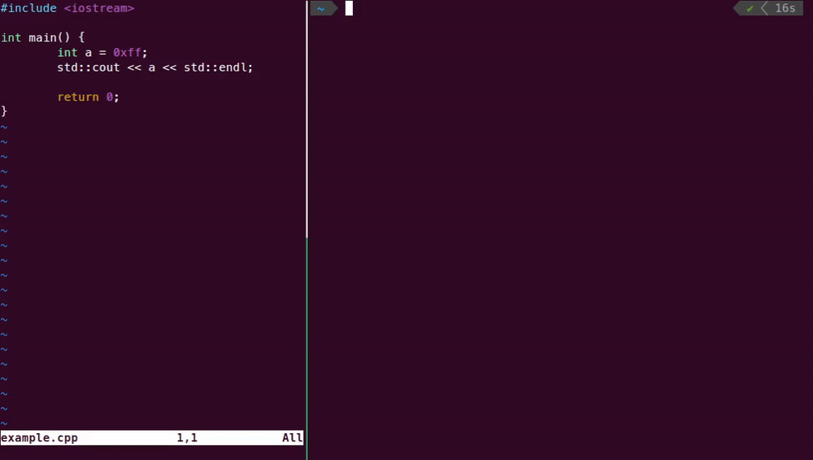

# autocheck
Following AUTOSAR guidelines can be easy and free!

Autocheck is a source code analysis tool based on Clang / LLVM infrastructure.

Its main purpose is to check code against AUTOSAR guidelines for the use of the C++14 language in critical and safety-related systems. The main application sector of these guidelines is automotive, but these guidelines can be used in other embedded application sectors.



## Supported Operating Systems

- Ubuntu 20.04 or newer
- Debian 11 or newer

## Runtime dependencies

These packages have to be available in your distributions package repository. If they are, they will be automatically installed. Otherwise, the tool will not work.

- glibc version 2.31 or newer
- libstdc++ development package version 10 or newer

## Install package

### Ubuntu, Debian

Supports Ubuntu 20.04 and Debian 11 or newer.

To install the DEB package, run the following command:
```console
sudo apt install ./autocheck_[version]_amd64.deb
```
or open it using your Software Manager and click `Install`.

## Usage

Verify the installation was successful by running:
```console
$ autocheck --version
```

To display the help menu run:
```console
$ autocheck --help
```

To check all supported AUTOSAR rules on a file run the following command:
```console
$ autocheck [file]
```
For more options and examples see the following sections.

## Command line options

| Flag        | Description |
| ---         | ---         |
| `-W<rule>` | Enable the specified rule. For the full list of supported rules and their flags, see [AutosarRules](AutosarRules.md). By default all rules are on (same as `-Wall`). |
| `-Wno-<rule>` | Disable the specified rule. For the full list of supported rules and their flags, see [AutosarRules](AutosarRules.md). |
| `--check-between-lines=<from,to>` | Run autocheck only between given lines. |
| `--check-system-headers` | Check Autosar rules in system headers. |
| `--dont-check-headers` | Don't check Autosar rules in headers. |
| `--dont-check-macro-expansions` | Don't check Autosar rules in macro expansions. |
| `--extra-arg` | Argument to append to the compiler (e.g. include directory, link directory, define...). |
| `--extra-arg-before` | Argument to prepend to the compiler (e.g. include directory, link directory, define...). |
| `--warning-limit=<value>` | Set the limit of warnings per Autosar rule. By default, there is no limit. |
| `-p <build-path>` | Path to compile command database. For more information see the [compilation database section](#compilation-database). |

## Compilation Database

Autocheck requires a compilation database file (`compile_commands.json`) to work on a file that is a part of a project, otherwise it can't resolve include directives.
You can find out how to generate this file for your project [here](CompilationDatabase.md).
If the compilation database is not specifed using the `-p` flag, autocheck will try to automatically find it.
It will first search the directory of the first input file and all of its parent directories.
If the file couldn't be found the following warning will be displayed:
```
Error while trying to load a compilation database:
Could not auto-detect compilation database for file "test.cpp"
No compilation database found in /path/to/input or any parent directory
fixed-compilation-database: Error while opening fixed database: No such file or directory
json-compilation-database: Error while opening JSON database: No such file or directory
Running without flags.
```

## Examples

Let's look at the following code:
```cpp
#include <iostream>

int main() {
    int a = 0xff;
    std::cout << a << std::endl;

    return 0;
}
```

Running autocheck without extra options checks all AUTOSAR rules in the given file and the files it includes:

```
$ autocheck example.cpp
=== Autocheck - Modern and Free Autosar checker
example.cpp:4:12: warning: Hexadecimal constants should be upper case [A2-13-5]
        int a = 0xff;
                  ^
example.cpp:4:2: warning: Fixed width integer types from <cstdint>, indicating the size and signedness, shall be used in place of the basic numerical types [A3-9-1]
        int a = 0xff;
        ^
example.cpp:4:6: warning: Braced-initialization {}, without equals sign, shall be used for variable initialization [A8-5-2]
        int a = 0xff;
            ^
example.cpp:4:6: warning: Constexpr or const specifiers shall be used for immutable data declaration [A7-1-1]
4 warnings generated.
```

You can specify which AUTOSAR rules to check:
```
$ autocheck -Wnon-braced-init-used example.cpp
=== Autocheck - Modern and Free Autosar checker
example.cpp:4:6: warning: Braced-initialization {}, without equals sign, shall be used for variable initialization [A8-5-2]
        int a = 0xff;
            ^
1 warning generated.
```

or you can exclude certain rules by adding `no-` as a prefix to the flag:
```
$ autocheck -Wall -Wno-non-braced-init-used example.cpp
=== Autocheck - Modern and Free Autosar checker
example.cpp:4:12: warning: Hexadecimal constants should be upper case [A2-13-5]
        int a = 0xff;
                  ^
example.cpp:4:2: warning: Fixed width integer types from <cstdint>, indicating the size and signedness, shall be used in place of the basic numerical types [A3-9-1]
        int a = 0xff;
        ^
example.cpp:4:6: warning: Constexpr or const specifiers shall be used for immutable data declaration [A7-1-1]
        int a = 0xff;
            ^
3 warnings generated.
```

An AUTOSAR compliant version of the example looks like this:
```cpp
#include <iostream>

int main() {
    std::int32_t const a{0xFF};
    std::cout << a << std::endl;

    return 0;
}
```

## Common issues

- At the end of installation the following message is displayed: `Download is performed unsandboxed as root as file '...' couldn't be accessed by user '_apt'. - pkgAcquire::Run (13: Permission denied)`

  This is just a note, not an error. The installation was not affected by this message, and everything was installed properly.
It means that the `_apt` user which is used to install packages doesn't have permission to access the folder where the package is located. For example this includes all directories in `/home/[user]`.

- Running autocheck reports `fatal error: 'iostream' file not found` (or any other C++ header)

  This happens when the latest gcc and libstdc++ versions don't match. For example if you have gcc 12 installed, but not `libstdc++-12-dev`. To fix this install the matching version of libstdc++ by running:
  ```console
  sudo apt install libstdc++-[version]-dev
  ```
  just replace `[version]` with the latest version of gcc installed on your system. On Ubuntu 22 this is most likely 12.

- Running autocheck shows `/lib/x86_64-linux-gnu/libc.so.6: version 'GLIBC_2.XX' not found (required by autocheck)`

  You are trying to use autocheck on an unsupported system. The list of supported operating systems can be found [here](#supported-operating-systems).
